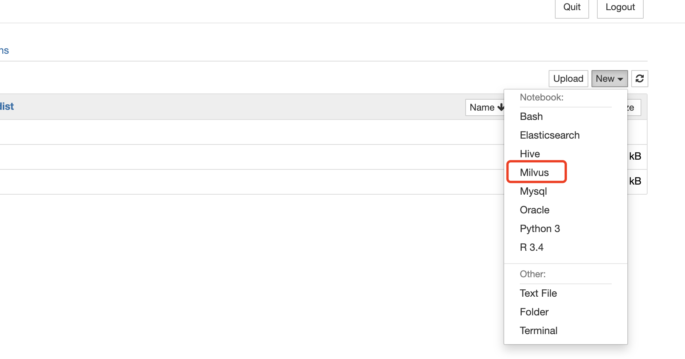
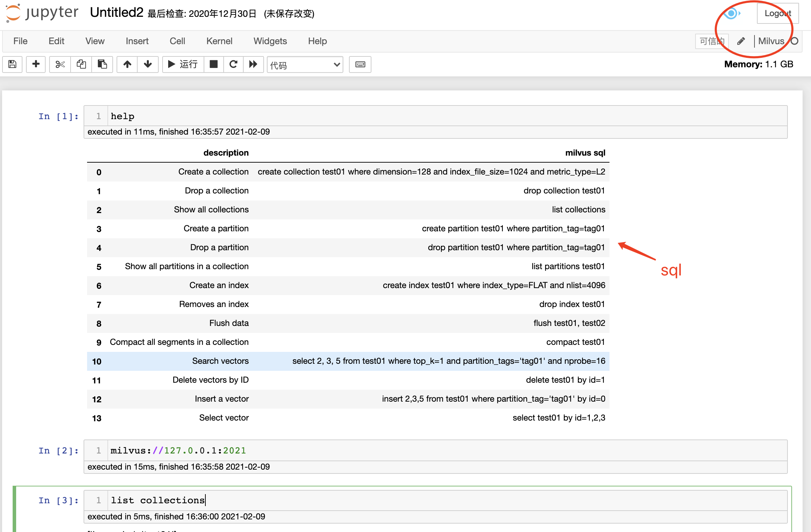

# milvus_kernel

Milvus Kernel for Jupyter


[](https://pypi.python.org/pypi/milvus_kernel)


[中文介绍](document/chinese.md)

## Installation

#### step1:
```
pip install milvus_kernel
```

To get the newest one from this repo (note that we are in the alpha stage, so there may be frequent updates), type:

```
pip install git+git://github.com/Hourout/milvus_kernel.git
```

#### step2:
Add kernel to your jupyter:

```
python3 -m milvus_kernel.install
```

ALL DONE! 🎉🎉🎉

## Uninstall

#### step1:

View and remove milvus kernel
```
jupyter kernelspec list
jupyter kernelspec remove milvus
```

#### step2:
uninstall milvus kernel:

```
pip uninstall milvus-kernel
```

ALL DONE! 🎉🎉🎉


## Using

```
jupyter notebook
```


### step1: you should set milvus host and port

### step2: write your milvus code




## Basic operations

## Connect to the Milvus server

1. Create a client to Milvus server by using the following methods:

   ```sql
   milvus://127.0.0.1:19530
   ```

## Create/Drop collections

### Create a collection

Create collection `test01` with dimension size as 128, size of the data file for Milvus to automatically create indexes as 1024, and metric type as Euclidean distance (L2).

   ```sql
   create table test01 where dimension=128 and index_file_size=1024 and metric_type='L2'
   ```

### Drop a collection

```sql
drop table test01
```

## Create/Drop partitions in a collection

### Create a partition

You can split collections into partitions by partition tags for improved search performance. Each partition is also a collection.

   ```sql
   create partition test01 where partition_tag='tag01'
   ```

verify whether the partition is created.

```sql
list partitions test01
```

### Drop a partition

```sql
drop partition test01 where partition_tag='tag01'
```

## Create/Drop indexes in a collection

### Create an index

> Note: In production, it is recommended to create indexes before inserting vectors into the collection. Index is automatically built when vectors are being imported. However, you need to create the same index again after the vector insertion process is completed because some data files may not meet the `index_file_size` and index will not be automatically built for these data files.

Create an index for the collection. The following command uses `IVF_FLAT` index type as an example

   ```sql
   create index test01 where index_type='FLAT' and nlist=4096
   ```

### Drop an index

```sql
drop index test01
```

## Insert/Delete vectors in collections/partitions

### Insert vectors in a collection

1. Insert a vector. If you do not specify vector ids, Milvus automatically generates IDs for the vectors.

   ```sql
   insert 2,3,5 from test01
   ```

   Alternatively, you can also provide user-defined vector ids:

   ```sql
   insert 2,3,5 from test01 where by id=0
   ```

### Insert vectors in a partition

```sql
insert 2,3,5 from test01 where partition_tag='tag01' by id=0
```

To verify the vectors you have inserted. Assume you have vector with the following ID.

```sql
select test01 by id=1,2,3
```

### Delete vectors by ID

You can delete these vectors by:

```sql
delete test01 by id=1
```

## Flush data in one or multiple collections to disk

When performing operations related to data changes, you can flush the data from memory to disk to avoid possible data loss. Milvus also supports automatic flushing, which runs at a fixed interval to flush the data in all collections to disk. You can use the [Milvus server configuration file](https://milvus.io/docs/reference/milvus_config.md) to set the interval.

```sql
flush test01, test02
```

## Compact all segments in a collection

A segment is a data file that Milvus automatically creates by merging inserted vector data. A collection can contain multiple segments. If some vectors are deleted from a segment, the space taken by the deleted vectors cannot be released automatically. You can compact segments in a collection to release space.

```sql
compact test01
```

## Search vectors in collections/partitions


### Search vectors in a collection

```sql
select 2, 3, 5 from test01 where top_k=1 and partition_tags='tag01' and nprobe=16
```


## Quote 
kernel logo


- https://blog.csdn.net/weixin_44839084/article/details/108070675
